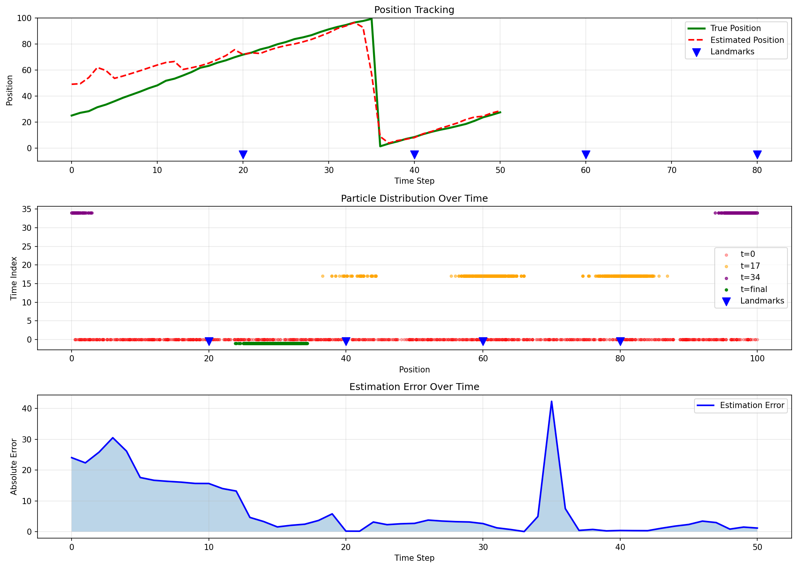
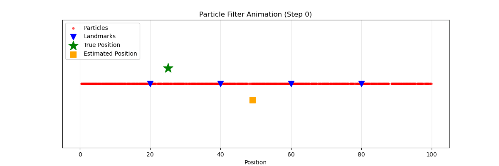

# Monte Carlo Localization: 1次元ロボット自己位置推定シュミレータ

[](https://github.com/nyantaro723/monte_carlo_localization/actions/workflows/test.yml)
[](https://www.python.org/)
[](LICENSE)

## 概要

このリポジトリは、**モンテカルロ法（パーティクルフィルタ）** を用いた1次元ロボット自己位置推定のシュミレータです。ロボットがセンサー観測と移動制御のみから自身の位置を推定する過程を、パーティクルフィルタアルゴリズムで実装しています。

### 🎯 何ができるのか？

- **自己位置推定**: ロボットが未知の環境で自身の位置を推定
- **パーティクルフィルタ** による逐次的な位置更新
- **可視化**: パーティクル分布の時系列変化とアニメーションを自動生成
- **カスタマイズ可能**: パラメータ調整で異なるシナリオをシュミレーション可能

---

## アルゴリズム: パーティクルフィルタ 

パーティクルフィルタは、**非線形・非ガウス過程** の状態推定に適した確率的アルゴリズムです。

### 動作原理

```
[初期化]
  → 位置不確定 → N個のパーティクルを全体に均等分布

[反復処理]
  ① 予測 
     制御入力からパーティクルを移動 + ノイズ付加
  
  ② 更新   
     センサー観測から各パーティクルの尤度を計算
     尤度に応じてパーティクルの重みを更新
  
  ③ リサンプリング 
     有効パーティクル数が少ない場合、重みに基づいてパーティクルを再抽出
     → 重みが高い（信頼度が高い）領域にパーティクルが集中
```

## プロジェクト構成

```
monte_carlo_localization/
├── particle_filter.py           # メインアルゴリズム実装
├── simulate_and_visualize.py    # シュミレーション & 可視化
├── requirements.txt              # 依存パッケージ
├── .gitignore                    # Git除外設定
└── README.md                     # このファイル
```

### ファイル説明

#### `particle_filter.py` (メイン実装)

**主要クラス:**

1. **`Config`** - シュミレーション設定
   - `num_particles`: パーティクル数（デフォルト: 1000）
   - `process_noise`: 移動ノイズの標準偏差
   - `measurement_noise`: センサーノイズの標準偏差
   - `landmark_positions`: ランドマークの位置リスト

2. **`ParticleFilter`** - パーティクルフィルタの実装
   - `predict(control)`: 予測ステップ
   - `update(measurement)`: 更新ステップ
   - `resample()`: リサンプリング
   - `filter_step()`: 1ステップ分の処理
   - `estimate_position()`: 現在の位置推定値を取得
   - `get_confidence()`: 推定の信頼度を計算

3. **`Robot`** - 1次元ロボットシュミレータ
   - `move(control)`: ロボットを移動（ノイズ付き）
   - `observe_landmark()`: 最も近いランドマークまでの距離を観測

#### `simulate_and_visualize.py` (実行スクリプト)

**主要関数:**

- `simulate()`: シュミレーションを実行（50ステップ）
- `plot_results()`: 3種類のグラフを生成
  - 位置推定の時系列
  - パーティクル分布の時間変化
  - 推定誤差
- `plot_particle_animation()`: アニメーション生成（GIF）

---

## インストール & 実行

### 前提条件
- Python 3.8以上

### セットアップ

```bash
# リポジトリをクローン
git clone https://github.com/nyantaro723/monte_carlo_localization.git
cd monte_carlo_localization

# 依存パッケージをインストール
pip install -r requirements.txt
```

### 実行方法

```bash
# シュミレーションを実行して可視化を生成
python simulate_and_visualize.py
```

**出力:**
- `simulation_results.png` - 3つのプロット図
- `particle_filter_animation.gif` - パーティクルフィルタのアニメーション
- ターミナルに各ステップの推定結果を表示

---

## 結果例



### グラフ 1: 位置推定の精度
- **緑線**: ロボットの真の位置
- **赤点線**: フィルタの推定位置
- **青矢印**: ランドマーク（観測対象）

真の位置に推定位置が追従していることが確認できます。

### グラフ 2: パーティクル分布の時間変化
- **赤・オレンジ・紫・緑の点**: 異なる時刻でのパーティクル位置
- 時間とともにパーティクルが真の位置周辺に集中していく様子が見られます

### グラフ 3: 推定誤差
- 初期段階では誤差が大きい
- 観測を繰り返すことで誤差が減少（収束）



---

## カスタマイズ例

### 1. パラメータの調整

```python
from particle_filter import ParticleFilter, Robot, Config

# カスタム設定
config = Config(
    world_size=200.0,           # ワールドサイズを拡大
    num_particles=5000,         # パーティクル数を増加
    process_noise=2.0,          # ロボットの移動ノイズを増加
    measurement_noise=2.0,      # センサーの精度を向上
    landmark_positions=[10, 50, 100, 150, 190]  # ランドマーク数を増加
)

robot = Robot(50.0, config)
pf = ParticleFilter(config)
```

### 2. 異なる移動パターン

```python
# 直線運動でなく、周期的な運動をシュミレート
for step in range(100):
    control = 5.0 + 3.0 * np.sin(2 * np.pi * step / 20)
    robot.move(control)
    measurement = robot.observe_landmark()
    pf.filter_step(control, measurement)
```

### 3. ノイズ特性の実験

```python
# ノイズなし（理想的）
config_ideal = Config(process_noise=0.1, measurement_noise=0.1)

# 高ノイズ（現実的）
config_realistic = Config(process_noise=1.5, measurement_noise=5.0)
```

---

## パラメータ選択ガイド

### パーティクル数 (`num_particles`)

| パーティクル数 | 特性 | 推奨用途 |
|-------|------|--------|
| 100-500 | 高速・低精度 | 初期実験、デバッグ |
| 1000-5000 | 標準 | 本格シュミレーション |
| 5000+ | 低速・高精度 | 精密計測が必要な場合 |

### ノイズ標準偏差

- **`process_noise` が大きい** → ロボットの移動が不確実
- **`measurement_noise` が大きい** → センサーが不正確

実際のロボットのスペックに合わせて調整してください。

### リサンプリング閾値 (`resample_threshold`)

- `0.1` - 積極的にリサンプリング（計算量増加）
- `0.5` - 標準（推奨）
- `0.9` - 控えめにリサンプリング（多様性保持）

---

## 動作確認済み環境

- Ubuntu 24.04
- MacOS 
- Python 3.8, 3.9, 3.10, 3.11, 3.12

---

## ライセンス

- このプロジェクトはMITライセンスの下で公開されています。  
- 詳細は [LICENSE](LICENSE) ファイルを参照してください。

© 2025 Ryusei Matsuki